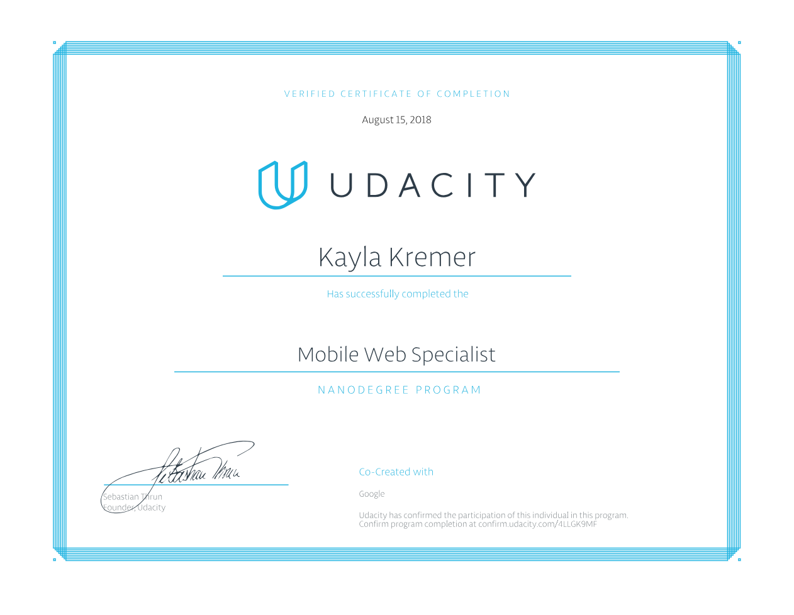

# Udacity Mobile Web Specialist Nanodegree - Restaurant Reviews

### :fork_and_knife: About
This is my completed project for Udacity's Mobile Web Specialist Nanodegree certification. I took this program for free after receiving a scholarship from Google for it, which is part of their [Grow with Google Developer Scholarship Program](https://www.udacity.com/grow-with-google). The project consisted of three stages and required me to build a progressive web app from scratch about restaurant reviews. Features I had to implement include:
* Responsive Design
* A11y
* Service Workers
* Caching, IndexedDB, & Local Storage
* Web Tooling & Optimization (Gulp, Babel, ESLint)
* Data Submission (Online & Offline)
* Lighthouse audit scores of >90

### :fork_and_knife: Server
First you will need to run the server. Navigate to the `UdacityMobileWebSpecialist/server` directory in your terminal and then run the command 'node server' to start the Sails server on port `1337`. For more information, visit the server's repo for this project [HERE](https://github.com/udacity/mws-restaurant-stage-3)

### :fork_and_knife: Deployment
To deploy the app in your browser, navigate to the `UdacityMobileWebSpecialist` directory in your terminal and then run the command `gulp build`. This will generate a production build of the project and use BrowserSync to deploy it in your browser on port `5500`. 

### :fork_and_knife: Notes
I have changed Google maps to be static images when pages first load. You can change it back to a live map by clicking on it! All images are also set to lazy load to further help with page load performance. 

### :fork_and_knife: Certification

[Verification](https://graduation.udacity.com/confirm/4LLGK9MF)

